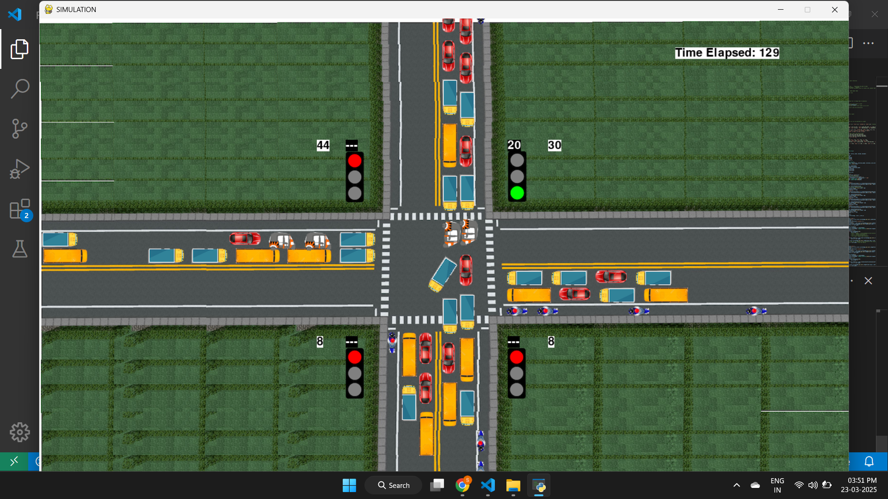

# 🚦 Traffic Intersection Simulation using Pygame

## 🏁 Overview
This is a **Traffic Intersection Simulation** built using **Pygame**. The simulation models vehicles moving through an intersection, following traffic signals, and provides real-time statistics.

## ✨ Features
- 🚗 **Vehicle Count Tracking** – Tracks vehicles crossing the intersection.
- ⏳ **Elapsed Time Display** – Shows the time elapsed since simulation start.
- ⏱️ **Custom Simulation Duration** – Set a custom simulation duration.
- 📊 **Real-Time Signal Timers** – Prints signal timers every second in the terminal.
- 📈 **Final Statistics** – Provides:
  - ✅ Direction-wise vehicle counts
  - 🚦 Total vehicles that crossed the intersection
  - 🕒 Total simulation runtime

## 🔧 Technologies Used
- 🐍 **Python 3.x**
- 🎮 **Pygame**

## 🚀 How to Run
1. Clone or download the project files.
2. Navigate to the project directory.
3. Run the simulation:
   ```bash
   python game.py
   ```
4. Watch the simulation and check the terminal for live stats.

## 📸 Screenshot

### 1️⃣ Simulation


## 🎥 Demo
A video demonstration is available **[here](#https://github.com/Shubham-Bendre/Smart-Traffic-Simulation/blob/main/screenshots/demo.mp4)**.


## 🔮 Future Enhancements
- 🤖 AI-based **Adaptive Signal Control** for smarter traffic flow.
- 🛣️ Improved vehicle pathfinding for more realistic movement.
- 🌍 Integration with real-world traffic data for research purposes.

---
Let me know if you need any changes! 🚥

